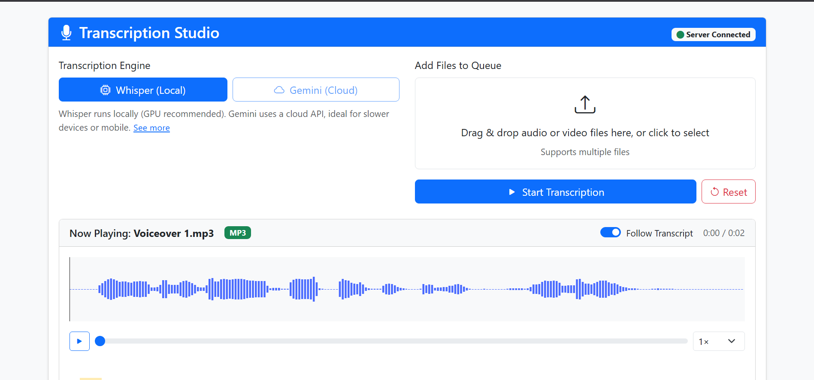

# 🎙️ Transcription App

A full-stack, containerized audio transcription system built with:

- ⚙️ **FastAPI** backend (Python) for real-time transcription (Whisper/Gemini engines)
- 🎨 **Laravel + React** frontend for a modern transcription studio interface
- 🐳 **Dockerized** for easy deployment and local dev

## 📸 Screenshots

### 🖥️ Transcription Studio UI

### 📊 Transcription Job View

## 🚀 Features

- ✅ Upload audio files (WAV, MP3, etc.)
- ✅ View waveforms and transcript in a split layout
- ✅ Run transcription using **Whisper** or **Gemini**
- ✅ Monitor status in a live queue
- ✅ Export results
- ✅ Toggle between Safe Mode / Dual Mode
- ✅ Fully local and private by default

### Backend
cd transcription_backend
python -m venv venv
source venv/bin/activate  # or venv\Scripts\activate on Windows
pip install -r requirements.txt
uvicorn app.main:app --reload --port 8001

### Frontend
npm run build
npm run dev
php artisan serve

transcription_frontend/
├── app/                  # Laravel backend
│   ├── Http/
│   │   └── Controllers/
│   │       └── Api/
│   │           ├── TranscriptionController.php
│   │           └── FileController.php
│   ├── Models/
│   │   └── TranscriptionJob.php
│   └── ...
├── resources/
│   ├── js/
│   │   ├── components/   # React components
│   │   │   ├── FileUpload.jsx
│   │   │   ├── AudioPlayer.jsx
│   │   │   ├── TranscriptViewer.jsx
│   │   │   ├── FileQueue.jsx
│   │   │   └── EngineSelector.jsx
│   │   ├── pages/
│   │   │   └── TranscriptionStudio.jsx
│   │   ├── app.js
│   │   └── bootstrap.js
│   └── views/
│       └── app.blade.php
├── routes/
│   ├── api.php
│   └── web.php
├── package.json
├── vite.config.js
└── ...

transcription_backend/
├── app/
│   ├── api/
│   │   ├── routes/
│   │   │   ├── transcribe.py
│   │   │   ├── analyze.py
│   │   │   └── status.py
│   ├── core/
│   │   ├── config.py
│   │   └── logging_config.py
│   ├── services/
│   │   ├── audio_utils.py
│   │   ├── whisper_transcriber.py
│   │   ├── gemini_transcriber.py
│   │   └── job_manager.py
│   ├── workers/
│   │   └── tasks.py
│   ├── models/
│   │   └── schemas.py
│   └── main.py
├── requirements.txt
└── README.md

